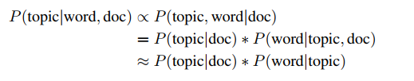

# LightLDA with warm start

Note: this is a modification of Microsoft's LightLDA implementation to support warm-start. Everything is the same, except for the initialization code in src/lightlda.cpp: if the command-line flag "warm_start" was set, we generate each token's topic probability distribution from the model and doc-topic files, instead of initializing each token's topic randomly.

The initial topic assignments are sampled from the topic probability distribution P(topic | word, doc), which is proportional to  P(topic | doc) * P(word | topic), under LDA's assumption that the word is conditionally independent of the document, given the topic.




# Installation instructions

See https://github.com/Microsoft/multiverso/wiki/LightLDA for more information.

Download:

``` git clone --recursive https://github.com/joshuafan/lightlda-warm-start ```

Installation (Linux):

``` sh ./build.sh ```

You may also need to take these steps if something doesn’t work:

* in ```~/.bashrc```, add location of libzmq.so.5 (multiverso/third_party/lib) to LD_LIBRARY_PATH, as follows:

```export LD_LIBRARY_PATH=/home/joshua/lightlda/multiverso/third_party/lib```

* increase RAM for lightlda (1 GB is not enough)

Additionally, a Python wrapper is available in python/lightlda_utils.py. 


-------------------------------------------------------------

Official documentation:

# LightLDA

LightLDA is a distributed system for large scale topic modeling. It implements a distributed sampler that enables very large data sizes and models. LightLDA improves sampling throughput and convergence speed via a fast O(1) metropolis-Hastings algorithm, and allows small cluster to tackle very large data and model sizes through model scheduling and data parallelism architecture. LightLDA is implemented with C++ for performance consideration.

We have sucessfully trained big topic models (with trillions of parameters) on big data (Top 10% PageRank values of Bing indexed page, containing billions of documents) in Microsoft. For more technical details, please refer to our [WWW'15 paper](http://www.www2015.it/documents/proceedings/proceedings/p1351.pdf). 

For documents, please view our website [http://www.dmtk.io](http://www.dmtk.io).

##Why LightLDA

The highlight features of LightLDA are

* **Scalable**: LightLDA can train models with trillions of parameters on big data with billions of documents, a scale previous implementations cann't handle. 
* **Fast**: The sampler can sample millions of tokens per second per multi-core node.
* **Lightweight**: Such big tasks can be trained with as few as tens of machines.

##Quick Start

Run ``` $ sh build.sh ``` to build lightlda.
Run ``` $ sh example/nytimes.sh ``` for a simple example.


##Reference

Please cite LightLDA if it helps in your research:

```
@inproceedings{yuan2015lightlda,
  title={LightLDA: Big Topic Models on Modest Computer Clusters},
  author={Yuan, Jinhui and Gao, Fei and Ho, Qirong and Dai, Wei and Wei, Jinliang and Zheng, Xun and Xing, Eric Po and Liu, Tie-Yan and Ma, Wei-Ying},
  booktitle={Proceedings of the 24th International Conference on World Wide Web},
  pages={1351--1361},
  year={2015},
  organization={International World Wide Web Conferences Steering Committee}
}
```

Microsoft Open Source Code of Conduct
------------

This project has adopted the [Microsoft Open Source Code of Conduct](https://opensource.microsoft.com/codeofconduct/). For more information see the [Code of Conduct FAQ](https://opensource.microsoft.com/codeofconduct/faq/) or contact [opencode@microsoft.com](mailto:opencode@microsoft.com) with any additional questions or comments.
